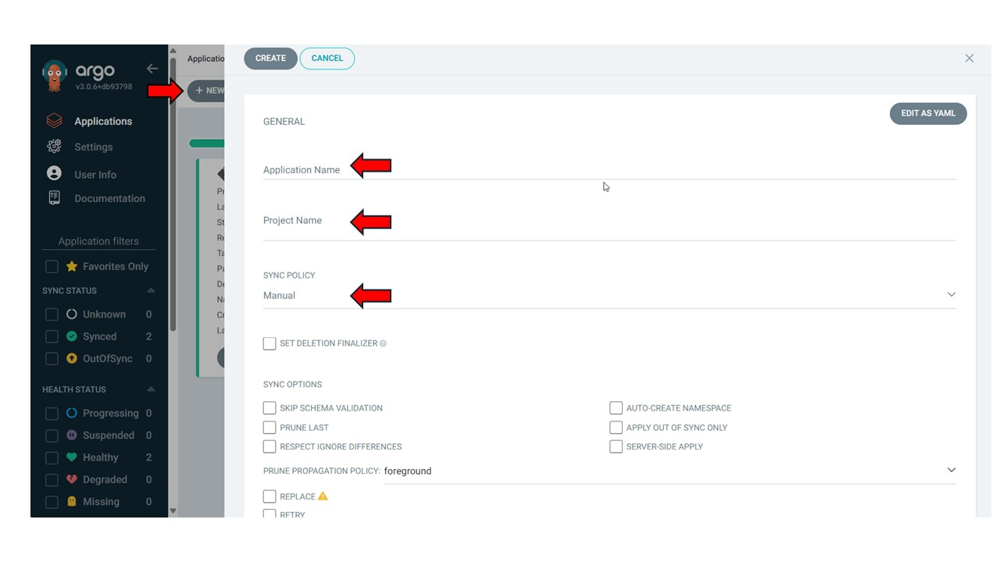
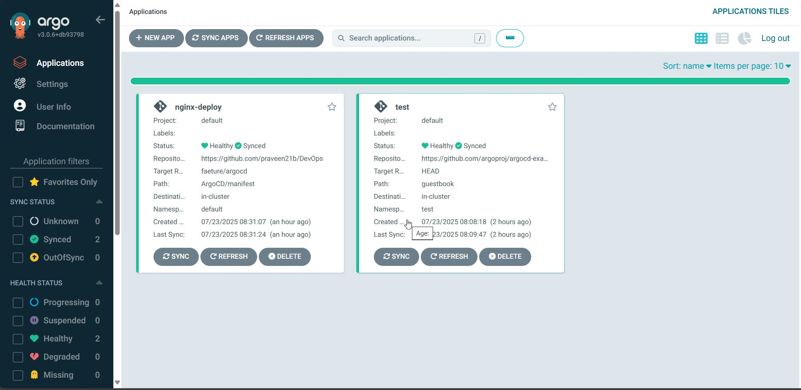

# 🚀 GitOps with Argo CD – Installation & Basic Usage

This guide walks you through installing **Argo CD** on a Kubernetes cluster and deploying applications using GitOps principles.

---

## 📋 Prerequisites

Make sure you have the following set up before starting:

- ✅ A Kubernetes cluster (e.g., Minikube, kind, EKS, GKE, etc.)
- ✅ `kubectl` configured and working (check with `kubectl get nodes`)
- ✅ Internet access to pull manifests from GitHub
- ✅ (Optional) Argo CD CLI tool (`argocd`) for enhanced control

---

## 🔧 Install Argo CD

1. **Create the Argo CD namespace:**

   ```bash
   kubectl create namespace argocd
    ```

2. **Install Argo CD components:**
    ```bash
    kubectl apply -n argocd -f  
    ```

3. **Expose ArgoCD Dashboard via NodePort:**
    To access the ArgoCD dashboard, patch the argocd-server service:
    ```bash
    kubectl -n argocd patch svc argocd-server \
        -p '{"spec": {"type": "NodePort"}}'
    ```

    Get the NodePort and your node IP to access the UI:
    ```bash
    kubectl -n argocd get svc argocd-server
    ```

    Access ArgoCD UI using `http://<NodeIP>:<NodePort>`.

4. **Log In to ArgoCD:**
    Get the initial admin password:

    ```bash
    kubectl -n argocd get secret argocd-initial-admin-secret -o jsonpath="{.data.password}" | base64 -d
    ```

    Log in using username admin and the decoded password.

5. **Connect ArgoCD to GitHub Repository:**

    In the ArgoCD UI or via CLI, add your GitHub repository that contains the Kubernetes manifests.

    Example using CLI:
    ```bash
    argocd repo add https://github.com/<your-username>/<repo-name> \
        --username <your-username> \
        --password <your-token-or-password>
    ```

6. **Create an Application in ArgoCD via Dashboard:**
    Once your GitHub repository is connected, follow these steps to create an application using the ArgoCD dashboard:

    - Navigate to the ArgoCD UI.

    - Click on **"NEW APP"**.

    - Fill in the following details:

    - **Application Name**: `nginx-deploy` (or any name of your choice)

    - **Project**: `default`

    - **Sync Policy**: Manual or Automatic

    - **Repository URL**: Your GitHub repo (e.g., `https://github.com/<your-username>/<repo-name>`)

    - **Revision**: `HEAD` or a specific branch like `main`

    - **Path**: Folder where manifest files reside (e.g., `ArgoCD/manifest`)

    - **Cluster**: `https://kubernetes.default.svc`

    - **Namespace**: default or your desired namespace

    - Click **Create**.

    - Click **Sync** to deploy the application.

    

    