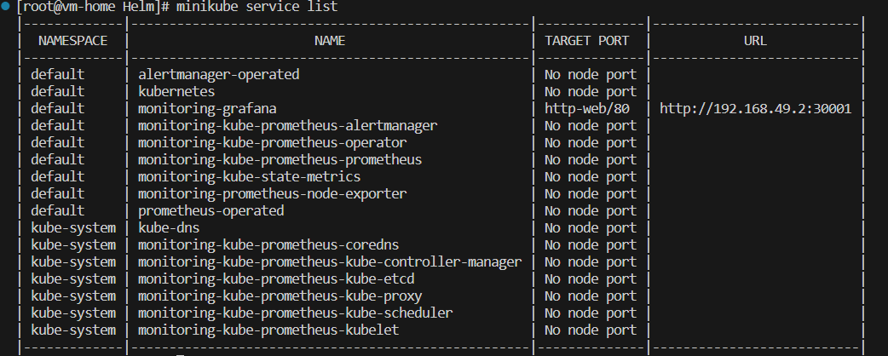
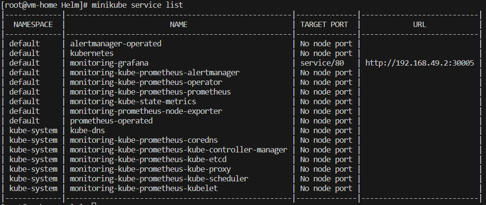

# Helm
[Helm](https://helm.sh/) is a package manager for Kubernetes. Helm is the bset wat to find, share, and use software built for Kubernetes.

> Lets say we have been tasked with installing the relational database service, e.g. `mysql` into the cluster, before installing we need to know how many pods we need for this service, pod definition, stateful or daemonset etc. So, we need to do quite bit of configuretion here. Also, we need to need to know about the `mysql` to configure it in a best possible way that it works efficiently. Here Helm gives us a solution by providing the idempotent configuration for the respective service (and provides the simple commands to install it e.g. `helm install mysql`).

> IMPORTANT:
> Helm charts can be found in [Artifact Hub](https://artifacthub.io/).

## Prerequites

- [Install Helm](https://helm.sh/docs/intro/install/)
    ```bash
    curl -O https://get.helm.sh/helm-v3.12.2-linux-amd64.tar.gz

    tar -zxvf helm-v3.12.2-linux-amd64.tar.gz

    mv linux-amd64/helm /usr/local/bin/helm
    ```
- Kubernetes cluster (Here we are using minikube, [Minikube installation](https://minikube.sigs.k8s.io/docs/start/))
  ```bash
  # Minikube installation
  curl -LO https://storage.googleapis.com/minikube/releases/latest/minikube-latest.x86_64.rpm
  sudo rpm -Uvh minikube-latest.x86_64.rpm
  minikube start --driver=none --force
  ```

## Contents
1. [Install MYSQL (Demo)](#install-mysql-demo)
2. [Working with Chart Values](#monitoring-stack)
3. [Working with Chart Values](#working-with-chart-values)
4. [Override values.yaml](#override-valuesyaml)
5. [Snowflake Clusters](#snowflake-clusters)


## Install MYSQL (Demo)
- Visit [ArtifactHub](https://artifacthub.io/packages/helm/bitnami/mysql)
- ```bash
  helm install mysql oci://registry-1.docker.io/bitnamicharts/mysql
  ```
  This will install the mysql charts/packages.

  Check the created `mysql` pod using below command.
  ```bash
  [root@vm-home projects]# kubectl get pod -A
  NAMESPACE     NAME                               READY   STATUS    RESTARTS        AGE
  default       mysql-0                            1/1     Running   0               84s
  kube-system   coredns-5d78c9869d-99md5           1/1     Running   0               5m24s
  kube-system   etcd-minikube                      1/1     Running   0               5m36s
  kube-system   kube-apiserver-minikube            1/1     Running   0               5m36s
  kube-system   kube-controller-manager-minikube   1/1     Running   0               5m39s
  kube-system   kube-proxy-kjt9m                   1/1     Running   0               5m25s
  kube-system   kube-scheduler-minikube            1/1     Running   0               5m37s
  kube-system   storage-provisioner                1/1     Running   1 (4m54s ago)   5m34s
  ```

  ```bash
  [root@vm-home projects]# kubectl get all
  NAME          READY   STATUS    RESTARTS   AGE
  pod/mysql-0   1/1     Running   0          5m9s

  NAME                     TYPE        CLUSTER-IP      EXTERNAL-IP   PORT(S)    AGE
  service/kubernetes       ClusterIP   10.96.0.1       <none>        443/TCP    9m23s
  service/mysql            ClusterIP   10.102.103.65   <none>        3306/TCP   5m9s
  service/mysql-headless   ClusterIP   None            <none>        3306/TCP   5m9s

  NAME                     READY   AGE
  statefulset.apps/mysql   1/1     5m9s
  ```
  > **Note**: statefulset will give the guaranteed name to the pod*

- List out all the installed chart
  ```bash
  helm list
  ```

- Uninstalling the helm chart
  ```bash
  helm delete mysql
  ```

- To list the helm repositories
  ```bash
  helm repo list
  ```

## Monitoring Stack

1. Source Chart Link: https://artifacthub.io/packages/helm/prometheus-community/kube-prometheus-stack
2. Check for pods and services
    ```bash
    NAME                                      TYPE        CLUSTER-IP      EXTERNAL-IP   PORT(S)                      AGE
    alertmanager-operated                     ClusterIP   None            <none>        9093/TCP,9094/TCP,9094/UDP   22m
    kubernetes                                ClusterIP   10.96.0.1       <none>        443/TCP                      93m
    monitoring-grafana                        NodePort    10.108.255.76   <none>        80:30001/TCP                 23m
    monitoring-kube-prometheus-alertmanager   ClusterIP   10.101.29.161   <none>        9093/TCP,8080/TCP            23m
    monitoring-kube-prometheus-operator       ClusterIP   10.101.24.227   <none>        443/TCP                      23m
    monitoring-kube-prometheus-prometheus     ClusterIP   10.96.108.197   <none>        9090/TCP,8080/TCP            23m
    monitoring-kube-state-metrics             ClusterIP   10.97.203.115   <none>        8080/TCP                     23m
    monitoring-prometheus-node-exporter       ClusterIP   10.106.201.15   <none>        9100/TCP                     23m
    prometheus-operated 
    ```
3. we can observe that the `grafana` service of `ClusterIP` type. Lets change it `NodePort` and observ the grafana dashboard.
  Use `kubectl edit svc monitoring-grafana`, then edit `type: NodePort` and add `nodePort: 30001` under `ports`

    ```bash
    [root@vm-home Helm]# minikube service monitoring-grafana
    |-----------|--------------------|-------------|---------------------------|
    | NAMESPACE |        NAME        | TARGET PORT |            URL            |
    |-----------|--------------------|-------------|---------------------------|
    | default   | monitoring-grafana | http-web/80 | http://192.168.49.2:30001 |
    |-----------|--------------------|-------------|---------------------------|
    🎉  Opening service default/monitoring-grafana in default browser...
    👉  http://192.168.49.2:30001
      ```
## Working with Chart Values

In the previous step we have accessed the grafana dashboard but we didnt knew the login credentials. In this section we go on deep regarding the same.

We can know about the login credintials via the documnetion of the charts. There is also another option provided by helm to check these values i.e. with `helm show values <chart_name>`
```bash
helm show values prom-repo/kube-prometheus-stack
```
This will give a massive output which is inform of key-values pair (refer: values.yaml file).

Find the `adminPassword` for grafana in values.yaml file. But lets say we want to use `admin` as out new password. 
Then,
```bash
helm upgrade monitoring prom-repo/kube-prometheus-stack --set adminPassword=admin
```
will deplyed as version 2. Unfortunately, the service type reset to `ClusterIP`. Lets edit again using `kubectl edit service monitoring-grafana`. We still can access the grafana dashboard, but we can successfully log in to the dashborad. This is because we have made a mistake in setting the `adminPassword`. Since the entries inside the values.yaml are hierarchical, we need to specify the parent block name. e.g: grafana.adminPassword. **_Again, our service type `NodePort` overridden by below command and set it to `ClusterID`._**
```bash
helm upgrade monitoring prom-repo/kube-prometheus-stack --set grafana.adminPassword=admin
```

## Override values.yaml
Since, checking the service type inside the values.yaml is not fruitful, we can check out the gitHub page for [Grafana Helm charts](https://github.com/grafana/helm-charts/tree/main/charts/grafana). Go to Configuration section, then search for `service.type`, which has set to `ClusterIP` as default type and `service.nodePort` to `nil`.

With the below command we can override these values.

```bash
helm upgrade monitoring prom-repo/kube-prometheus-stack --set grafana.adminPassword=admin --set grafana.service.type=NodePort --set grafana.service.nodePort=30001
```

> **_Output:_**
>  

**OR**
- We can also modify the values under grafana as shown below:

```yaml
grafana:
  adminPassword: admin
  service:
    portName: service
    type: NodePort
    nodePort: 30005 # used different port since we are already using 30001 from above command
```
Now,
```console
helm upgrade monitoring prom-repo/kube-prometheus-stack --values values.yaml
```
we can see the service list here:



## Snowflake Clusters
A Snowflake is always unique in comaparing with other. Lets come to our topic Helm, we use helm to install many package in quick second using `helm install`. Since we have no track of all the packages that we have installed this leads to many pods and we dont know which configuration we performed at that time. And recreation of same pods would be challenging and also the remote chart from which we install will not persists always. This type of cluster we can name it as `snowflake clusters` (similar concept to the `snowflake servers`). We can avoid this by downlaoding the source code for the repective chart and make changes we need and then install. Since we have the source code and we always delete the packages we have installed.
