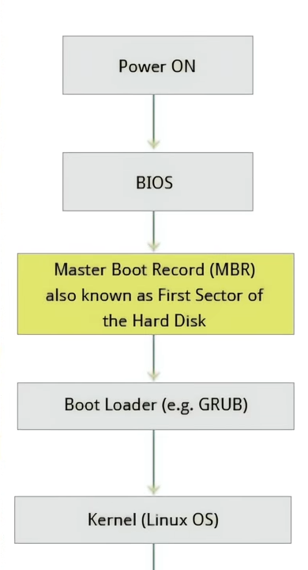

# Linux Cash Course

## Chapter 1: Introduction to Linux Families
### The Major Linux Distributions
1. **Red Hat Family Systems:** RHEL8, CentOS 
2. **SUSE Family Syatems:** OpenSUSE
3. **Debian Family Systems:** Ubuntu

## Chapter 2: Linux Philosopy and Concepts

Inrefering to the cases where the user has the choice to enter, like name of a program or file the linux community uses short hand **`FOO`**, basically represents insert file name here.

### Commonly Used Linux Terminology
| Name | Description |
| ---- | ----------- |
| Kernel | Considered brain of linux OS that gllued between applicaion and hardware. The kernel controls the hardware and makes the harware to interact with the application. |
| Distribution | Also known as the Distros, Collection of software  making up a linux based OS. |
| Boot Loader | program that boots the OS, e.g. GRUB, ISOLINUX |
| Service | Program that runs as a background process e.g. httpd, nfsd, ntpd, ftpd and named |
| File System | Method for storing and  organizing files e.g. ext3, ext4, FAT, XFS, NTFS, and Btefs | 
| X Window System | Provides standard tool kit and protocol to build graphical (user interface) subsystem on nearly all linux systems |
| Desktop Environment | Graphical User Interface on the top of the Operating System e.g. GNOME, KDE, Xface, and Fluxbox |
| Command Line | Interface for typing commands on the top of the operating system |
| Shell | Command line interpreter that interprets the command line inputs and instructs the OS to perform any necessary  tasks and commands e.g. bash, tcsh, and zsh |

### Linux Kernel

## Chapter 3: Linux Basics and System Startup
### BIOS- **_Basic Input Output System_**

  

